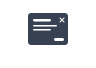
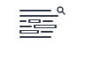

  
  <h1>BrowUI</h1>
  
<strong>What can HTML and CSS do natively, today and tomorrow?
A living record of the platform, one pattern at a time.</strong>

BrowUI documents what modern web standards can already do,
and what they are becoming. Each pattern is a snapshot of
the native browser platform at a specific moment: what works
everywhere, what works in some browsers, and what is just
arriving. The goal is not production readiness, it is
visibility into where the platform is going.

The files in this repository contain only the core mechanisms behind each pattern. They intentionally do not include the presentation layer used on the website. The website presents the mechanisms in a readable, testable, and comparable context, but visual design is not the purpose of the project.

- [Project website](https://browui.com/)
- [Changelog](./CHANGELOG.md)

## Principles

- Native HTML first
- CSS for layout, state, motion, and interaction mechanics
- No component JavaScript
- No framework
- No dependencies
- Copy-paste friendly
- Mechanisms over presentation
- Progressive enhancement over reimplementation

## Components

BrowUI focuses on small, portable patterns that can live inside any website or application.

### User Interface Components

Eight interface patterns rebuilt with modern HTML and CSS only. Each example starts from native browser behavior, then adds progressive CSS for layout, state, motion and theming. No JavaScript, no dependencies, no build step.

| Component |  |  |
| --- | --- | --- | 
|  | Carousel | Native horizontal scrolling with `scroll-snap`, custom scrollbars and controls via `::scroll-button`. |
|  | Modal | A real modal with `<dialog>`, opened without JavaScript via `commandfor` and `command="show-modal"`. |  
|  | Popover | A non-modal panel with `popover`, `popovertarget` and native light dismiss. |  
|  | Accordion | Using `
`, `
`, and the `name` attribute that turns a group into an exclusive accordion. |  
|  | Tabs | Pure CSS with a real radio group, `:checked` and `:has()` on the parent. |  
|  | Tooltip | Positioned via `anchor-name` and `position-anchor`. The tooltip follows its anchor without JS. | 
|  | Progress Bar | A top progress bar driven by scroll with `animation-timeline`. |   
|  | Switch | Styled checkboxes with `:has()` to modify the parent based on state. |  

### Browser User Interface

Four browser interface behaviors styled with modern CSS only. Each example keeps the native feature in charge, then exposes a focused CSS layer for highlights, scrollbars, focus states and form controls. No JavaScript, no dependencies, no build step.

| Component |  |  |
| --- | --- | --- | 
|  | Selection & search | Selected text and find-in-page matches styled with `::selection`, `::search-text` and `::search-text:current`. |
|  | Themed scrollbars | Custom scrollbars with WebKit pseudo-elements and Firefox's `scrollbar-color`, scoped per rendering engine. |  
|  | Focus Management | Accessible focus states with `:focus-visible`, keeping keyboard navigation clear without styling every click. |  
|  | Form UX | Native form controls themed with `accent-color`, `::placeholder`, `:user-valid`, and `:user-invalid`. |  

## Pattern Status

This table gives a quick project-level snapshot. It does not replace the
browser support tables in each pattern README, which remain the source of
truth for feature-by-feature support.

| Pattern | Status | Notes |
| --- | --- | --- |
| Focus Management | Stable baseline | Built on `:focus` and `:focus-visible`, with broad modern browser support. |
| Form UX | Stable baseline | Uses native controls and progressive styling hooks such as `accent-color`, `::placeholder`, and user validation states. |
| Switch | Stable baseline | Uses a real checkbox, label activation, `:checked`, `:focus-visible`, and `:has()`. |
| Popover | Broad modern support | The Popover API and declarative controls are available across modern browsers, with positioning and animation still progressive. |
| Modal | Broad modern support | `<dialog>` is broadly supported; declarative `commandfor` controls are newer and should be treated as progressive. |
| Accordion | Broad modern support | `
` and `
` are stable; exclusive groups and smooth details animations depend on newer features. |
| Tabs | Practical with caveats | Uses native radio semantics rather than the ARIA tabs pattern. Good for small static tab switchers, not a full tabs replacement. |
| Themed scrollbars | Progressive styling | Scroll behavior remains native; visual styling varies across engines and operating systems. |
| Tooltip | Progressive enhancement | Basic hover and focus behavior works with CSS; anchor positioning is newer and should keep a fallback. |
| Progress Bar | Progressive enhancement | Scroll-driven animation support is improving, but unsupported browsers should simply skip the visual indicator. |
| Selection & search | Experimental search styling | `::selection` is stable; `::search-text` is still emerging and currently limited. |
| Carousel | Experimental controls | Native scroll snapping is usable; generated buttons, markers, active-slide state, and initial targets are still experimental. |

## Documentation and Demos

Interactive examples, explanations, browser support notes, and implementation details are available on the website:

[browui.com](https://browui.com)

The website is the place to learn how each pattern works. This repository is intended to stay focused on the reusable HTML and CSS source.

## Repository Philosophy

This repository should stay intentionally small.

It is not a component library, package, design system, or framework. It does not ship JavaScript APIs, theme presets, build configuration, or demo infrastructure.

The HTML and CSS files are meant to show the minimum structure and CSS mechanisms required for each pattern to work. They are not meant to provide finished UI components.

The goal is simple:

1. Open a component folder.
2. Copy the mechanism.
3. Integrate it into your project.

## Browser Support

BrowUI uses modern web platform features. Browser support tables are checked snapshots, not compatibility promises. They intentionally document features at different stages of maturity: stable, recently shipped, experimental, and emerging.

Some examples rely on recent browser APIs or CSS selectors, such as:

- `<dialog>`
- Popover API
- `:has()`
- `:focus-visible`
- CSS scroll-driven animations
- CSS anchor positioning
- Native form validation states

Support varies by component. Check the corresponding page on [browui.com](https://browui.com) for full browser support details and verify the linked Can I Use data before treating a pattern as broadly available.

## What BrowUI Is Not

BrowUI is not trying to replace JavaScript where JavaScript is the right tool.

It is a standards-first exploration of native browser capabilities. Some UI patterns can be built with HTML and CSS alone. Some cannot. The project tries to make those boundaries visible and practical.

## Contributing

Contributions should keep the project focused:

- Prefer native HTML elements.
- Avoid component JavaScript.
- Keep CSS focused on behavior and mechanisms.
- Avoid adding site-specific presentation rules.
- Document browser-specific limitations on the website.
- Keep examples readable and portable.

Before adding a new pattern, ask whether it can be understood as plain HTML and CSS without requiring a local build step or project-specific setup.
